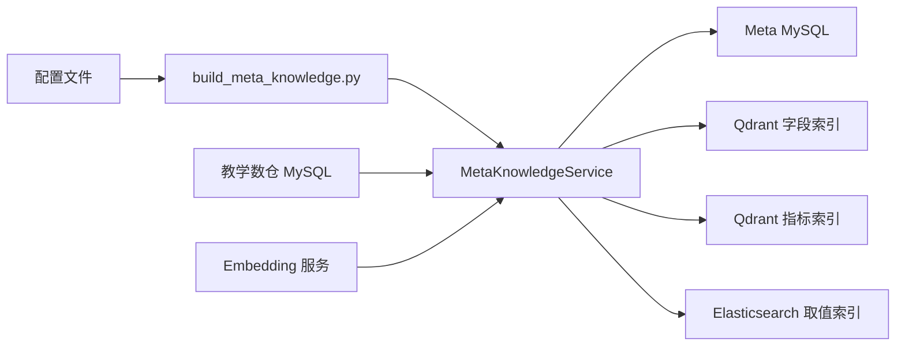
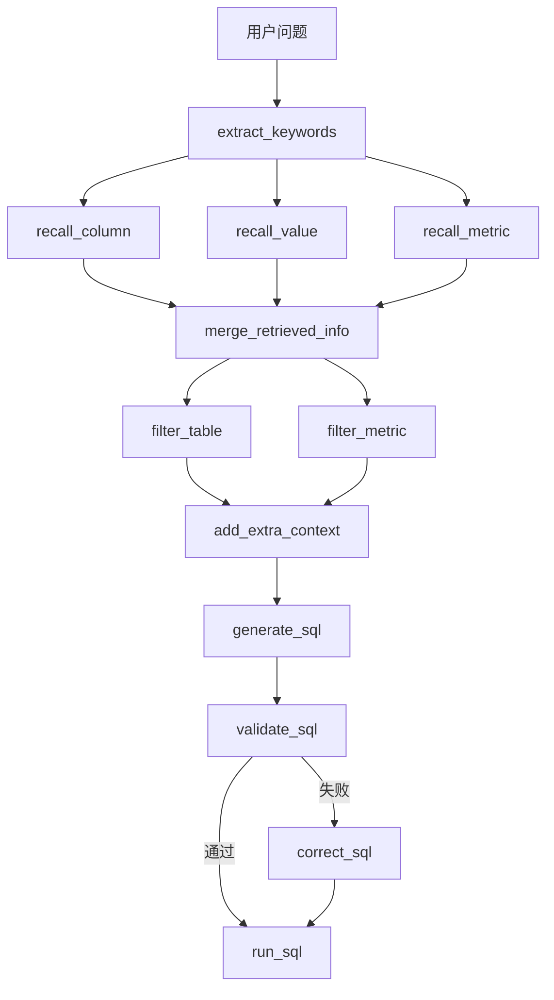

# shopkeeper-agent 一周速成学习指南

## 1. 先建立心智模型

`shopkeeper-agent` 本质上是一个面向企业问数场景的 Agent 后端，而不是通用聊天机器人。

它要解决的问题不是“怎么让模型回答问题”，而是“怎么让模型在库表复杂、字段口径多、用户不会写 SQL 的前提下，尽量稳定地生成并执行正确 SQL”。

这个项目的核心策略可以概括成一句话：

> 先检索，再推理，再生成 SQL，而不是直接把自然语言丢给大模型。

你可以把它拆成两条主线来看：

1. 元数据知识库构建链路
   - 从教学数仓和配置中提取表、字段、指标、真实取值。
   - 把结构化元数据落到 MySQL。
   - 把字段和指标的语义入口做成 Qdrant 向量索引。
   - 把字段真实取值做成 Elasticsearch 全文索引。

2. 问数执行链路
   - 用户输入自然语言问题。
   - 系统先抽关键词，再并行召回字段、指标、真实取值。
   - 合并和过滤候选信息，补充生成 SQL 所需上下文。
   - 最后生成、校验、修正并执行 SQL。

如果你一开始就从某个节点文件钻进去，容易只看到细节。更好的方法是先把这两条主线记住，再去读代码。

## 2. 项目整体结构怎么理解

这个仓库当前的学习重心在 `app` 目录，根目录 [main.py](D:\pythonProject\shopkeeper-agent\main.py) 只是占位入口，不是正式业务主入口。

建议你先把项目分成 6 层：

1. 配置层
   - `pyproject.toml`
   - `conf/app_config.yaml`
   - `.env.example`
   - `docker/docker-compose.yaml`

2. Client Manager 层
   - 负责初始化和关闭外部依赖客户端。
   - 例如 MySQL、Qdrant、Elasticsearch、Embedding。

3. Repository 层
   - 负责和存储系统直接交互。
   - MySQL Repository 处理结构化元数据和数仓访问。
   - Qdrant Repository 处理字段/指标向量检索。
   - ES Repository 处理字段取值全文检索。

4. Service 层
   - 负责编排业务动作。
   - 当前最核心的是 [app/services/meta_knowledge_service.py](D:\pythonProject\shopkeeper-agent\app\services\meta_knowledge_service.py)。

5. Agent 层
   - 用 LangGraph 把问数链路编排成一张图。
   - 核心入口是 [app/agent/graph.py](D:\pythonProject\shopkeeper-agent\app\agent\graph.py)。

6. Script 层
   - 作为可执行入口调用服务层。
   - 当前最关键的是 [app/scripts/build_meta_knowledge.py](D:\pythonProject\shopkeeper-agent\app\scripts\build_meta_knowledge.py)。

## 3. 你需要哪些前置知识

下面按三档来分：`必须掌握`、`看懂即可`、`可后补`。

### 3.1 必须掌握

#### Python 工程基础

1. 虚拟环境和依赖管理
   - 需要知道 `uv` 是做什么的。
   - 需要看懂 `pyproject.toml` 和 `uv.lock` 的关系。
   - 需要知道为什么项目要求 `Python >= 3.14`。

2. 异步编程
   - 要理解 `async/await`。
   - 要看懂“初始化客户端 -> 执行异步查询 -> 关闭连接”的生命周期。
   - 要知道 `AsyncSession`、异步客户端和异步图执行为什么会一起出现。

3. 基本分层思维
   - `client manager` 负责准备连接能力。
   - `repository` 负责存取数据。
   - `service` 负责业务编排。
   - `agent node` 负责图中的单步任务。

#### 数据库与 SQL

1. MySQL 基础
   - 建议熟悉表、字段、主键、外键、事务的基本概念。

2. 常见 SQL
   - `select`
   - `where`
   - `group by`
   - 聚合函数
   - `join`
   - `order by`
   - `limit`

3. 元数据和业务数据的区别
   - 元数据：描述表、字段、指标、字段别名、字段角色。
   - 业务数据：订单、销量、区域等真实数据。
   - 这个项目会同时访问两套 MySQL：一套存元数据，一套模拟教学数仓。

4. 数仓最小概念
   - 事实表和维度表是什么。
   - 指标为什么依赖多个字段。
   - 为什么字段的“真实取值”能帮助问数理解。

#### 检索系统基础

1. 向量检索
   - 用来处理“语义接近但字面不完全一致”的问题。
   - 这里主要用于召回字段和指标。

2. 全文检索
   - 用来根据关键词命中真实取值。
   - 这里主要用 Elasticsearch 处理字段取值搜索。

3. 为什么字段/指标进 Qdrant，真实取值进 Elasticsearch
   - 字段和指标更偏语义匹配。
   - 真实取值更偏关键词和文本匹配。
   - 这就是项目里的混合检索思路。

### 3.2 看懂即可

#### LLM / Agent 基础

1. Prompt 驱动节点
   - 每个节点不一定都直接调用模型，但它们都在为生成 SQL 准备上下文。

2. LangGraph 状态图思想
   - 状态 `State` 用来承载共享数据。
   - 上下文 `Context` 用来承载外部依赖。
   - 节点按边连接形成执行流。

3. 为什么生成 SQL 前还要过滤、校验、修正
   - 单靠召回很容易引入噪声。
   - 单靠生成很容易出错。
   - 过滤和校验本质上是在给 SQL 生成做约束。

#### 配置与环境基础

1. Docker Compose
   - 能看懂每个服务是什么、端口是什么即可。

2. `.env`
   - 要知道这里主要是放 `LLM_API_KEY`。

3. OmegaConf
   - 不需要深入原理，但要知道这个项目用它加载 YAML 配置。

### 3.3 可后补

1. SSE
   - 项目设计里会涉及流式返回，但一周速成不是必须先吃透。

2. 日志链路
   - `Loguru + request_id` 这类工程细节可以后补。

3. 部署优化
   - 包括容器资源、索引性能、模型服务吞吐等，不是第一周重点。

## 4. 代码阅读的正确顺序

不要按文件名一个个散着看。建议按下面顺序：

1. `pyproject.toml`
   - 看技术栈、Python 版本、核心依赖。

2. `conf/app_config.yaml`
   - 看项目依赖的服务和默认端口。

3. `docker/docker-compose.yaml`
   - 看本地运行要起哪些组件。

4. [app/scripts/build_meta_knowledge.py](D:\pythonProject\shopkeeper-agent\app\scripts\build_meta_knowledge.py)
   - 它是“知识库构建链路”的执行入口。

5. [app/services/meta_knowledge_service.py](D:\pythonProject\shopkeeper-agent\app\services\meta_knowledge_service.py)
   - 它是理解项目数据准备逻辑的核心。

6. `app/clients/*`
   - 看每种外部依赖如何初始化。

7. `app/repositories/*`
   - 看不同存储系统承担什么职责。

8. [app/agent/graph.py](D:\pythonProject\shopkeeper-agent\app\agent\graph.py)
   - 它是问数执行链路总编排入口。

9. `app/agent/state.py` 和 `app/agent/context.py`
   - 看图在节点之间传递什么。

10. `app/agent/nodes/*`
   - 最后再看节点细节，避免一开始陷在局部实现里。

## 5. 项目主链路说明

### 5.1 知识库构建链路

建议从 [app/scripts/build_meta_knowledge.py](D:\pythonProject\shopkeeper-agent\app\scripts\build_meta_knowledge.py) 进入。

这个脚本的职责不是承载复杂业务逻辑，而是：

1. 初始化 MySQL、Qdrant、Elasticsearch、Embedding 客户端。
2. 创建 Repository。
3. 把这些依赖注入 `MetaKnowledgeService`。
4. 调用 `build()` 启动一次完整的知识库构建。

真正的核心逻辑在 [app/services/meta_knowledge_service.py](D:\pythonProject\shopkeeper-agent\app\services\meta_knowledge_service.py) 里。你读这个文件时要重点抓 4 件事：

1. 表和字段怎么落到 Meta MySQL
   - 结构化元数据会作为权威存储写入 MySQL。
   - 表、字段、指标及其关联关系都在这里管理。

2. 字段怎么进 Qdrant
   - 一个字段不会只生成一个向量点。
   - 字段名、字段描述、字段别名都会被拆成多个语义入口。
   - 这能提高字段召回的鲁棒性。

3. 真实取值怎么进 Elasticsearch
   - 只有配置里允许同步的字段才会把真实取值写入 ES。
   - 这说明项目不是无脑全量建索引，而是带有控制策略。

4. 指标怎么进 Qdrant
   - 指标和字段一样，也会按名字、描述、别名拆成多个向量入口。
   - 这体现了“业务指标是独立检索对象”这件事。

你可以把这条链路总结成下面这张图：

### 5.2 问数执行链路

这条链路的总入口是 [app/agent/graph.py](D:\pythonProject\shopkeeper-agent\app\agent\graph.py)。

当前仓库里的核心执行顺序已经非常清晰：

1. `extract_keywords`
   - 从用户问题中提取关键词。

2. `recall_column`
   - 从字段向量索引里召回候选字段。

3. `recall_value`
   - 从 ES 里召回候选字段取值。

4. `recall_metric`
   - 从指标向量索引里召回候选指标。

5. `merge_retrieved_info`
   - 合并三路检索结果。

6. `filter_table`
   - 从合并结果里筛选更可能相关的表。

7. `filter_metric`
   - 从候选指标中继续过滤。

8. `add_extra_context`
   - 补充生成 SQL 需要的额外上下文。

9. `generate_sql`
   - 进入 SQL 生成阶段。

10. `validate_sql`
   - 做 SQL 校验。

11. `correct_sql`
   - 如果校验失败，先修正 SQL。

12. `run_sql`
   - 最终执行 SQL。

这条链路的亮点不在“节点多”，而在“节点分工明确”。它不是一个大 Prompt 包打天下，而是把召回、过滤、生成、校验拆成可观测、可扩展的图结构。

## 6. `State` 和 `Context` 该怎么理解

这部分是 Day 5 的重点，也是面试很容易被问到的地方。

### 6.1 `DataAgentState`

`DataAgentState` 代表一次问数过程中不断被节点更新的共享状态。

当前你至少要记住这些字段：

- `query`
- `keywords`
- `retrieved_column_infos`
- `retrieved_metric_infos`
- `retrieved_value_infos`
- `error`

学习时要重点想：

1. 哪些字段是输入。
2. 哪些字段是中间产物。
3. 哪些字段决定后续分支，比如 `error` 会影响校验后走修正还是直接执行。

### 6.2 `DataAgentContext`

`DataAgentContext` 不保存业务状态，而是保存节点运行时依赖的外部能力。

当前主要包括：

- `column_qdrant_repository`
- `embedding_client`
- `metric_qdrant_repository`
- `value_es_repository`

你可以把它理解成：

- `State` 是“这次问题处理到哪一步了”。
- `Context` 是“这次处理能调用哪些外部工具”。

这是一个很值得写进简历表述里的工程点，因为它体现了状态数据和外部依赖的分离。

## 7. 一周训练营式学习计划

下面这个日程是按“已有 Python 后端基础，希望一周内讲清项目”来设计的。

### Day 1：建立全局认知

#### 学习目标
- 搞清这个项目到底解决什么问题。
- 搞清它为什么不是“直接让 LLM 写 SQL”。
- 搞清系统里有哪些核心角色。

#### 学习内容
- 读 `pyproject.toml`
- 读 `conf/app_config.yaml`
- 读 `docker/docker-compose.yaml`
- 快速浏览 `app` 目录结构

#### 当天产出
- 一页纸架构概览

#### 你应该回答的问题
1. 这个项目的输入是什么。
2. 这个项目的输出是什么。
3. 它依赖哪些外部服务。
4. 为什么需要 MySQL、Qdrant、Elasticsearch、Embedding 四类能力同时存在。

#### 验收标准
- 能在 3 分钟内口头讲清项目全貌。

### Day 2：环境与配置

#### 学习目标
- 搞清本地运行环境。
- 搞清配置项和依赖服务的映射关系。

#### 学习内容
- `pyproject.toml`
- `.env.example`
- `conf/app_config.yaml`
- `docker/docker-compose.yaml`
- `app/conf/*`

#### 当天产出
- 环境依赖表，至少包含服务名、作用、端口、对应配置。

#### 你应该回答的问题
1. 为什么项目要求 Python 3.14。
2. `LLM_API_KEY` 在哪里用。
3. `embedding_size` 为什么会影响 Qdrant 集合创建。
4. MySQL 里为什么分 `meta` 和 `dw` 两套配置。

#### 验收标准
- 能解释每个服务为什么存在，而不是只记住端口。

### Day 3：知识库构建链路

#### 学习目标
- 吃透项目“准备数据给问数用”的部分。

#### 学习内容
- [app/scripts/build_meta_knowledge.py](D:\pythonProject\shopkeeper-agent\app\scripts\build_meta_knowledge.py)
- [app/services/meta_knowledge_service.py](D:\pythonProject\shopkeeper-agent\app\services\meta_knowledge_service.py)
- `app/repositories/mysql/*`
- `app/repositories/qdrant/*`
- `app/repositories/es/*`

#### 当天产出
- 一张“表/字段/指标/取值”落库与建索引流程图。

#### 你应该回答的问题
1. 为什么结构化元数据放 MySQL。
2. 为什么字段和指标分别建向量索引。
3. 为什么真实取值进 ES 而不是进 Qdrant。
4. 为什么字段和指标会拆成多个向量点。

#### 验收标准
- 能解释“结构化元数据”和“检索索引”为什么要分开存。

### Day 4：问数主图与状态流

#### 学习目标
- 吃透 LangGraph 主链路。

#### 学习内容
- [app/agent/graph.py](D:\pythonProject\shopkeeper-agent\app\agent\graph.py)
- `app/agent/state.py`
- `app/agent/context.py`

#### 当天产出
- LangGraph 执行顺序笔记
- 一张手画主链路图

#### 你应该回答的问题
1. 为什么关键词提取之后要三路并行召回。
2. 为什么合并后还要继续过滤。
3. 为什么校验失败后不是直接结束，而是进入 `correct_sql`。

#### 验收标准
- 能不看代码，手画出执行顺序并说明每个节点目的。

### Day 5：节点与仓储层协作

#### 学习目标
- 看懂一个节点是怎么用 `state` 和 `context` 调外部依赖的。

#### 学习内容
- `app/agent/nodes/recall_*`
- `app/agent/nodes/filter_*`
- `app/agent/nodes/generate_sql.py`
- `app/agent/nodes/validate_sql.py`
- `app/clients/*`

#### 当天产出
- 状态字段变化表

建议你自己整理成这样的形式：

| 节点 | 读取哪些 state | 使用哪些 context | 写回哪些 state |
| --- | --- | --- | --- |
| extract_keywords | query | - | keywords |
| recall_column | keywords | embedding_client, column_qdrant_repository | retrieved_column_infos |
| recall_value | keywords | value_es_repository | retrieved_value_infos |
| recall_metric | keywords | embedding_client, metric_qdrant_repository | retrieved_metric_infos |

#### 你应该回答的问题
1. 为什么 Repository 不直接出现在全局，而是通过 Context 进入节点。
2. 为什么节点之间通过 State 传中间结果。
3. 当前哪些节点是骨架占位，哪些已经有明确行为。

#### 验收标准
- 能讲清“节点如何通过 state/context 串起来”。

### Day 6：亮点、设计取舍、简历表达

#### 学习目标
- 把“看懂代码”转成“会讲项目”。

#### 学习内容
- 回顾 Day 1 到 Day 5 的笔记。
- 提炼项目亮点、风险、适用边界。

#### 当天产出
- 1 分钟项目介绍
- 5 分钟项目介绍
- 简历项目描述

#### 这个项目最值得提炼的亮点
1. 检索增强 NL2SQL
   - 不是直接生成 SQL，而是先召回字段、指标、真实取值。

2. 混合检索设计
   - Qdrant 负责语义召回。
   - Elasticsearch 负责真实取值全文检索。

3. LangGraph 多阶段执行流
   - 把关键词提取、召回、过滤、生成、校验、修正、执行拆成可编排图。

4. 工程分层清晰
   - `client manager -> repository -> service -> graph/node` 分层明确。

5. 兼顾业务语义和工程可扩展性
   - 结构化元数据与检索索引分离，后续更容易扩展权限、审核、可视化等能力。

#### 需要诚实说明的边界
1. 效果依赖元数据质量。
2. 不是通用知识库问答项目。
3. 当前仓库里部分节点仍是章节式骨架，不是所有能力都完全落地。

#### 验收标准
- 能用 1 分钟和 5 分钟两个版本介绍项目。

### Day 7：复盘与输出

#### 学习目标
- 把零散理解变成自己的表达体系。

#### 学习内容
- 重写自己的项目讲解稿。
- 对照代码入口复盘模块职责。
- 做一次模拟面试回答。

#### 当天产出
- 最终学习笔记
- 面试问答清单
- 后续深挖方向列表

#### 你应该完成的事
1. 用自己的话重写项目架构。
2. 用自己的话重写知识库构建链路。
3. 用自己的话重写问数执行链路。
4. 用自己的话说明项目亮点、适用场景、局限性。

#### 验收标准
- 看到代码入口时，能快速定位它属于哪一层、负责什么职责。

## 8. 知识地图式阅读路径

如果你不想完全按天学，可以按下面这张知识地图推进。

### 模块 1：环境与配置

#### 解决什么问题
- 项目运行依赖哪些服务。
- 配置从哪里来。
- 本地环境为什么这样搭。

#### 依赖什么
- `pyproject.toml`
- `conf/app_config.yaml`
- `docker/docker-compose.yaml`
- `.env.example`

#### 读这个模块时要回答
1. 这项目要起哪些服务。
2. 每个服务的配置从哪里读。
3. 哪些配置是运行期必须存在的。

### 模块 2：数据接入与客户端

#### 解决什么问题
- 项目如何初始化外部依赖并管理生命周期。

#### 依赖什么
- `app/clients/mysql_client_manager.py`
- `app/clients/qdrant_client_manager.py`
- `app/clients/es_client_manager.py`
- `app/clients/embedding_client_manager.py`

#### 读这个模块时要回答
1. 为什么 client 不在 import 时就直接初始化。
2. 为什么要显式 `init()` 和 `close()`。
3. 为什么 MySQL 要维护两套客户端配置。

### 模块 3：仓储层

#### 解决什么问题
- 不同存储系统分别负责什么。

#### 依赖什么
- `app/repositories/mysql/*`
- `app/repositories/qdrant/*`
- `app/repositories/es/*`

#### 读这个模块时要回答
1. MySQL、Qdrant、Elasticsearch 的职责边界是什么。
2. Repository 和 Service 的边界是什么。
3. 为什么字段、指标、取值不放在同一种索引里统一处理。

### 模块 4：服务层

#### 解决什么问题
- 如何把配置、数仓、索引构建动作编排成一条完整业务链路。

#### 依赖什么
- [app/services/meta_knowledge_service.py](D:\pythonProject\shopkeeper-agent\app\services\meta_knowledge_service.py)

#### 读这个模块时要回答
1. 为什么 Service 决定事务边界。
2. 为什么 Service 决定哪些字段需要同步真实取值。
3. 为什么字段和指标都要拆成多个 embedding point。

### 模块 5：Agent 层

#### 解决什么问题
- 如何把问数过程组织成可编排、可观测的执行图。

#### 依赖什么
- [app/agent/graph.py](D:\pythonProject\shopkeeper-agent\app\agent\graph.py)
- `app/agent/state.py`
- `app/agent/context.py`
- `app/agent/nodes/*`

#### 读这个模块时要回答
1. 为什么是图而不是单函数串行流程。
2. 为什么状态和依赖要分开。
3. 图里的哪些步骤是为了召回，哪些步骤是为了约束生成。

## 9. 项目亮点与适用场景

### 9.1 项目亮点

1. 检索增强的 NL2SQL 设计
   - 项目没有走“用户问题 -> LLM -> SQL”的最短路径。
   - 它先做字段、指标、取值召回，再组织上下文，明显更贴近企业真实问数场景。

2. 混合检索方案清晰
   - 语义相似的问题交给 Qdrant。
   - 字段真实值搜索交给 Elasticsearch。
   - 结构化权威元数据交给 MySQL。

3. LangGraph 把复杂链路显式化
   - 关键词提取、三路召回、结果合并、过滤、补充上下文、SQL 生成、校验、修正、执行分成独立节点。
   - 这比单体函数和大 Prompt 更容易扩展和排查。

4. 工程组织比较规范
   - 客户端初始化、仓储访问、服务编排、Agent 图执行分层清楚。
   - 很适合拿来讲工程化能力，而不只是讲模型调用。

5. 兼顾学习价值和项目价值
   - 这个仓库能让你同时练到：Python 后端、异步、检索系统、LangGraph 编排、NL2SQL 思维。

### 9.2 适用场景

1. 企业内部问数
   - 运营、销售、供应链、财务等角色希望用自然语言查数。

2. 库表较多、指标较复杂的环境
   - 适合字段口径多、业务别名多、靠纯 Prompt 容易翻车的场景。

3. 需要后续扩展的问数底座
   - 例如继续加权限控制、SQL 审核、结果可视化、多数据源接入。

### 9.3 不适合的场景

1. 通用知识库问答
2. 只依赖文档检索、几乎不查结构化数据的场景
3. 元数据极度混乱、没有基本数据治理的环境

## 10. 面试与简历表达模板

### 10.1 1 分钟介绍版本

我做过一个企业问数 Agent 后端项目，目标是解决业务人员不会写 SQL、但又要从复杂数仓里快速查数的问题。这个项目没有直接把用户问题丢给大模型生成 SQL，而是先通过混合检索召回相关字段、业务指标和真实字段取值，再用 LangGraph 把关键词提取、检索、过滤、SQL 生成、校验和执行串成一条多阶段链路。底层我把结构化元数据放在 MySQL，字段和指标语义索引放在 Qdrant，字段真实取值放在 Elasticsearch，这样能兼顾语义召回和精确匹配，也更适合后续扩展权限、审核和可观测能力。

### 10.2 5 分钟介绍版本

这个项目本质上是一个面向企业 BI / NL2SQL 场景的问数后端。它的核心问题是，企业环境里表很多、字段很杂、业务别名很多，如果直接让大模型从自然语言生成 SQL，很容易选错字段、理解错指标口径，最终 SQL 可执行性和正确率都不稳定。

所以这个项目采用了“先检索、再推理、再生成”的设计。第一条主线是知识库构建链路：从教学数仓和配置里抽取表、字段、指标和字段真实取值，把结构化元数据落到 MySQL，把字段和指标做成 Qdrant 向量索引，把真实取值做成 Elasticsearch 全文索引。第二条主线是问数执行链路：用户提问后先做关键词提取，再并行召回字段、指标和真实取值，接着做结果合并和过滤，补齐生成 SQL 所需上下文，最后进入 SQL 生成、校验、修正和执行。

工程上我比较看重它的分层设计。项目把客户端初始化、仓储层、服务层和 LangGraph 节点分开，状态和运行时依赖也分成了 `State` 和 `Context` 两部分，所以这不是一个简单的 Demo，而是一个比较适合继续扩展的问数后端骨架。它特别适合写在简历上作为“检索增强 NL2SQL + Agent 编排 + 工程化分层”的项目经历。

### 10.3 简历项目描述模板

#### 简洁版
- 设计并实现企业问数 Agent 后端，基于 `MySQL + Qdrant + Elasticsearch + LangGraph` 构建检索增强 NL2SQL 链路，支持字段/指标/真实取值多路召回、SQL 生成校验与执行。

#### 强调工程版
- 参与企业级问数 Agent 后端设计，采用 `client manager + repository + service + graph node` 分层架构，使用 `Qdrant` 承载字段/指标语义检索、`Elasticsearch` 承载字段真实取值检索、`MySQL` 管理结构化元数据，并通过 `LangGraph` 编排多阶段问数执行流。

#### 强调亮点版
- 构建检索增强的 NL2SQL 系统，针对企业数仓字段复杂、指标口径多的问题，引入字段/指标向量召回与真实取值全文检索，降低大模型直接生成 SQL 的歧义与错误率。

## 11. 一周后你至少要达到什么水平

完成这一周后，至少要做到：

1. 能讲清项目为何不是直接 LLM 写 SQL。
2. 能讲清 `Qdrant` 和 `Elasticsearch` 的职责分工。
3. 能描述 [app/agent/graph.py](D:\pythonProject\shopkeeper-agent\app\agent\graph.py) 中的执行顺序。
4. 能解释 [app/services/meta_knowledge_service.py](D:\pythonProject\shopkeeper-agent\app\services\meta_knowledge_service.py) 在整套系统中的角色。
5. 能说出这个项目的亮点、适用场景、风险和边界。
6. 能用自己的话做 1 分钟和 5 分钟两种版本介绍。

## 12. 最后给你的学习建议

1. 不要试图第一天就读完所有节点文件。
   - 先抓主线，再看细节，效率更高。

2. 不要把注意力只放在 LLM。
   - 这个项目真正有价值的地方，是“检索 + 结构化元数据 + 图编排”的组合。

3. 每天都要有产出。
   - 不是只看代码，而是要写图、写表、写讲稿。

4. 如果你的目标是面试或简历，优先保证你能讲清：
   - 解决了什么问题。
   - 为什么这样设计。
   - 相比直接大模型生成 SQL 强在哪。
   - 工程上是怎么拆分的。

5. 一周速成的正确目标不是“全部实现都会写”，而是“看到代码能快速定位职责，能把系统讲清楚”。

只要你把这份文档里的 7 天计划认真走完，这个项目已经足够支撑你做一次比较完整的项目讲解了。
